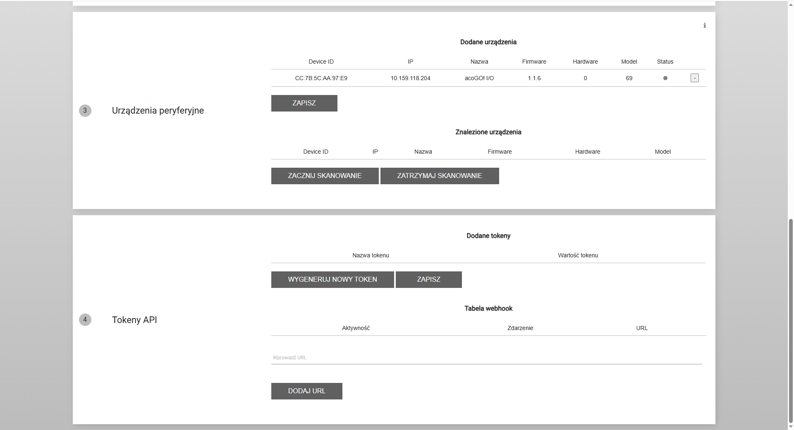
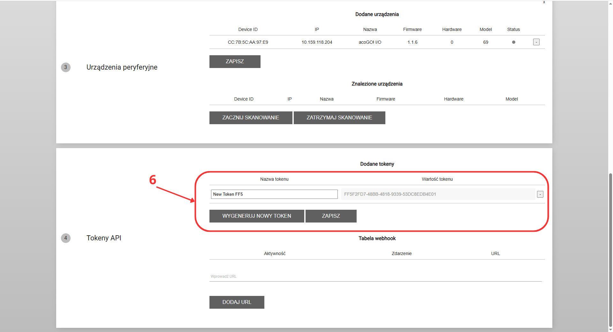

# Generowanie tokena API

Aby móc korzystać z integracji z bramką acoGO! przez własne aplikacje lub systemy, konieczne jest wygenerowanie indywidualnego tokena API. Token ten umożliwia bezpieczne uwierzytelnianie i kontrolę dostępu do funkcji bramki poprzez API.

## Jak wygenerować token API?

Aby wygenerować nowy token API, wykonaj poniższe kroki:

1. Połącz się z tą samą siecią lokalną, w której działa bramka acoGO! (np. WiFi lub przewodowo).
2. Wpisz adres IP bramki w przeglądarce internetowej, aby otworzyć panel logowania.
3. Zaloguj się do panelu administratora swoimi danymi dostępu.  
{ width=70% }
4. Przejdź do sekcji „Sieć” w menu głównym.  
{ width=70% }
5. W części oznaczonej numerem 4 („tokeny API”) znajdziesz opcje zarządzania tokenami.  
{ width=70% }
6. W tym miejscu możesz:
    - Wygenerować nowy token, nadać mu własną nazwę i skopiować go do dalszego użycia w aplikacji,
    - Wyświetlić listę już wygenerowanych tokenów,
    - Usuwać istniejące tokeny, jeśli dany dostęp nie jest już potrzebny.
 { width=70% }
