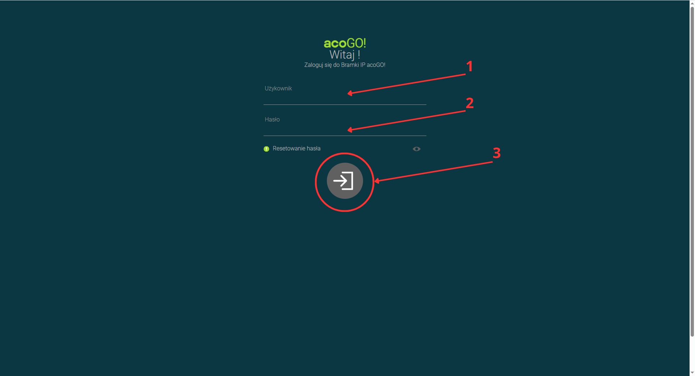
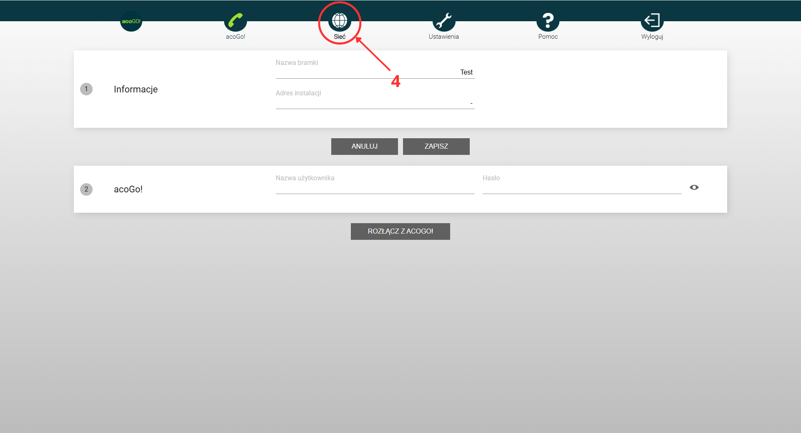
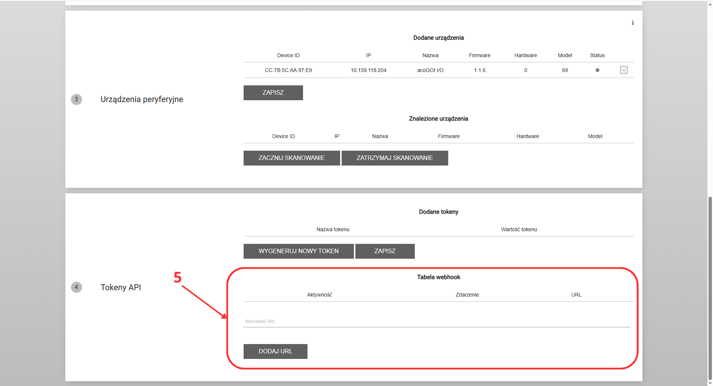
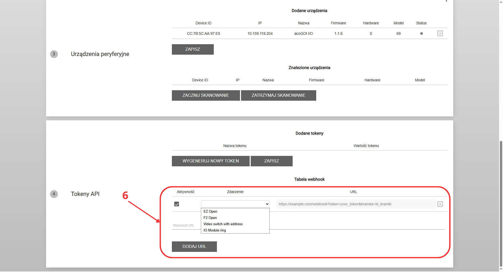

# Rejestracja webhooka w bramce acoGO!

Webhooki w bramce acoGO! pozwalają na automatyczne powiadamianie zewnętrznych systemów o zdarzeniach zachodzących w domofonie lub urządzeniu. Dzięki rejestracji webhooka możesz integrować bramkę z systemami alarmowymi, monitoringiem czy innymi aplikacjami obsługującymi webhooki.

## Jak zarejestrować webhooka?

Aby dodać nowego webhooka w bramce acoGO!, wykonaj następujące kroki:

1. Połącz się z siecią lokalną, w której działa bramka acoGO!.  
2. W przeglądarce internetowej wpisz adres IP bramki, co otworzy panel logowania.  
3. Zaloguj się przy użyciu swoich danych administratora.  
{ width=70% }
4. Przejdź do zakładki „Sieć” w menu głównym.  
{ width=70% }
5. W części oznaczonej numerem 4 znajdziesz ustawienia tabeli webhooków.  
{ width=70% }
6. W tym miejscu możesz:
    - Dodać nowy URL webhooka, który ma odbierać powiadomienia,
    - Wybrać, czy webhook ma być aktywny,
    - Określić, na jakie zdarzenia ma reagować dany webhook,
    - Usunąć niepotrzebne lub nieaktywne webhooki.
{ width=70% }