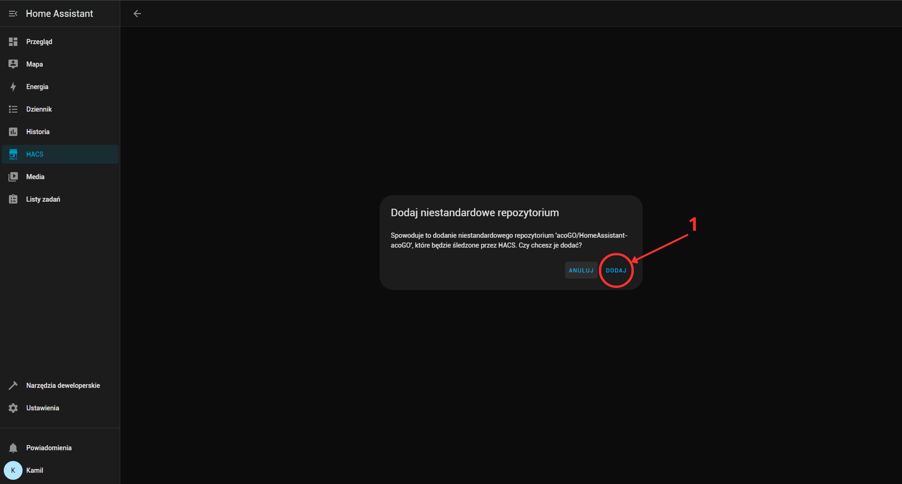
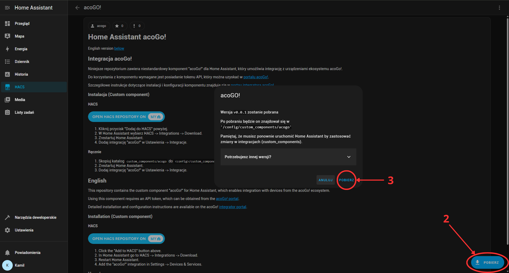
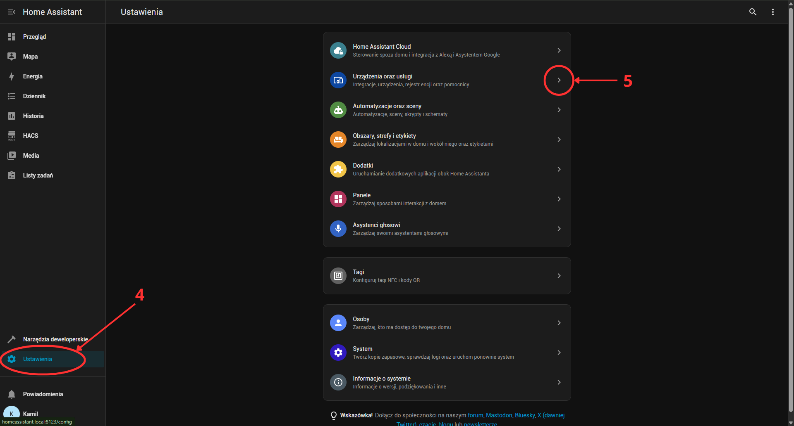
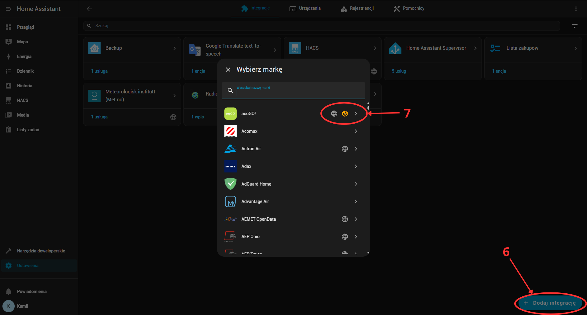
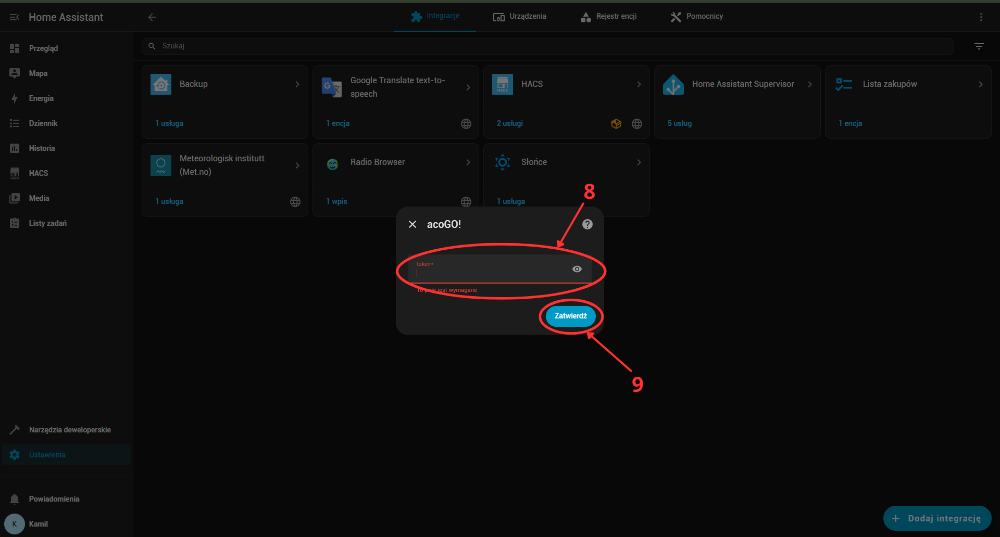
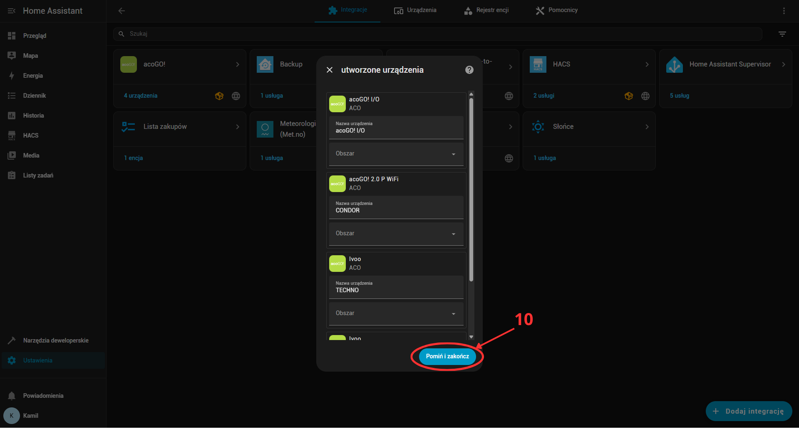

# Integracja acoGO! z Home Assistant

## O acoGO!

acoGO! to niestandardowy komponent dla Home Assistant umożliwiający integrację z ekosystemem acoGO!. 
Komponent pozwala na:

- Sterowanie urządzeniami acoGO! bezpośrednio z Home Assistant
- Monitorowanie stanu urządzeń w czasie rzeczywistym
- Automatyzację procesów domowych
- Integrację z innymi komponentami Home Assistant

## Instalacja za pomocą HACS

### Wymagania wstępne

- Zainstalowany [Home Assistant](https://www.home-assistant.io/)
- Zainstalowany [HACS](https://hacs.xyz/)
- Konto w systemie [acoGO!](https://portal.acogo.pl){target=_blank}

### Kroki instalacji i konfiguracji

1. Kliknij przycisk "Dodaj do HACS" poniżej. 

2. Dodaj niestandardowe repozytorium.  
{ width=70% }
3. Pobierz acoGO! i zrestartuj Home Assistant. 
{ width=70% }
4. Dodaj integrację "acoGo!" w Ustawienia -> Urządzenia oraz usługi -> Integracje.
{ width=70% }
5. Kliknij **Dodaj integrację** i wybierz acoGO! 
{ width=70% }
6. Podaj token do systemu acoGo! ([generowanie tokena](../portal-acogo/generowanie-tokena.md))
{ width=70% }
7. Potwierdź konfigurację 
{ width=70% }

Po pomyślnej instalacji urządzenia acoGo będą dostępne w Home Assistant.

---

**Dokumentacja**: [acoGO/HomeAssistant-acoGo](https://github.com/acoGO/HomeAssistant-acoGo/tree/master)
