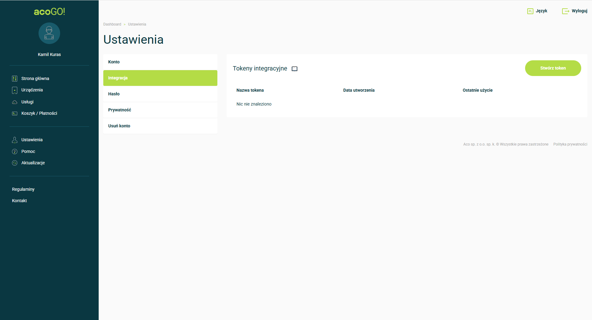

# Generowanie tokena API

Aby móc korzystać z integracji z bramką acoGO! przez własne aplikacje lub systemy, konieczne jest wygenerowanie indywidualnego tokena API. Token ten umożliwia bezpieczne uwierzytelnianie i kontrolę dostępu do funkcji bramki poprzez API.

## Jak wygenerować token API?

Aby wygenerować nowy token API, wykonaj poniższe kroki:

1. Zaloguj się na nasz portal[ acoGO!](https://portal.acogo.pl){target=_blank}.  
2. Wejdź w zakładkę <strong>Ustawienia</strong>, a następnie wybierz <strong>Integracje</strong>.  
{ width=70% }
3. W tym miejscu możesz:
    - Wygenerować nowy token, nadać mu własną nazwę i skopiować go do dalszego użycia w aplikacji. Pamiętaj że po stworzeniu tokena nie ma możliwości wyświetlenia go ponownie.
    - Wyświetlić listę już wygenerowanych tokenów, sprawdzić datę ich utworzenia oraz ostatniego użycia.
    - Usuwać istniejące tokeny, jeśli dany dostęp nie jest już potrzebny.